# Entity-Relationship Diagram

Auto-generated by `scripts/generate_erd.py`. Do not edit by hand.
Re-run after schema changes:

```sh
uv run --project backend python scripts/generate_erd.py
```

GitHub renders the Mermaid block below inline. For an interactive

```mermaid
erDiagram
    activities {
        uuid id PK
        uuid organization_id FK
        enum entity_type
        uuid entity_id
        uuid user_id FK
        enum activity_type
        jsonb payload
        datetime created_at
    }
    auth_action_tokens {
        string jti PK
        uuid user_id FK
        string purpose
        datetime expires_at
        datetime created_at
    }
    billing_settings {
        integer id PK
        boolean is_vat_payer
        numeric vat_rate_percent
        string seller_iban
        string seller_ico
        string contact_email
        string issuer_name
        string issuer_address_street
        string issuer_address_city
        string issuer_address_zip
        text issuer_register_text
        string issuer_account_domestic
        integer default_payment_term_days
        string invoice_email_subject_template
        text invoice_email_body_template
        datetime updated_at
    }
    blocked_companies {
        uuid id PK
        uuid organization_id FK
        string ico
        enum reason_category
        string note
        string ares_name
        uuid created_by FK
        datetime created_at
    }
    charges {
        uuid id PK
        uuid organization_id FK
        string kind
        integer amount_minor
        string currency
        string status
        string comgate_trans_id
        integer seats
        datetime period_starts_at
        datetime period_ends_at
        text failure_reason
        datetime created_at
        datetime paid_at
    }
    companies {
        uuid id PK
        uuid organization_id FK
        string name
        string ico
        string dic
        string address_street
        string address_city
        string address_zip
        string legal_form
        datetime registered_on
        string website
        string email
        string note
        uuid owner_user_id FK
        uuid main_contact_id FK
        datetime last_order_at
        datetime ownership_expires_at
        datetime ares_synced_at
        datetime created_at
        datetime updated_at
    }
    contacts {
        uuid id PK
        uuid organization_id FK
        uuid company_id FK
        string first_name
        string last_name
        string position
        string email
        string phone
        string linkedin_url
        string note
        datetime created_at
        datetime updated_at
    }
    deals {
        uuid id PK
        uuid organization_id FK
        uuid company_id FK
        uuid primary_contact_id FK
        uuid stage_id FK
        uuid owner_user_id FK
        string name
        numeric value
        string currency
        integer probability_override
        date expected_close_date
        datetime closed_at
        string lost_reason
        boolean is_paid
        datetime paid_at
        datetime created_at
        datetime updated_at
    }
    invitations {
        uuid id PK
        uuid organization_id FK
        string email
        enum role
        uuid team_id FK
        boolean can_invite
        uuid invited_by_user_id FK
        uuid token_jti
        datetime expires_at
        datetime accepted_at
        datetime revoked_at
        datetime created_at
    }
    invoice_audit_log {
        uuid id PK
        uuid invoice_id FK
        string event
        uuid actor_user_id FK
        jsonb payload
        datetime created_at
    }
    invoice_counters {
        integer year PK
        integer last_sequence
        datetime updated_at
    }
    invoice_lines {
        uuid id PK
        uuid invoice_id FK
        integer position
        text description
        numeric quantity
        string unit_label
        integer unit_price_minor
        numeric vat_rate_percent
        integer line_subtotal_minor
        integer line_vat_minor
        integer line_total_minor
    }
    invoices {
        uuid id PK
        uuid organization_id FK
        uuid subscription_id FK
        uuid charge_id FK
        string number
        integer year
        integer sequence_in_year
        string variable_symbol
        string status
        string kind
        uuid related_invoice_id FK
        datetime issued_at
        date taxable_supply_date
        date due_at
        datetime paid_at
        string issuer_name
        text issuer_address
        string issuer_ico
        string issuer_dic
        string issuer_iban
        string issuer_account_domestic
        text issuer_register_text
        boolean issuer_is_vat_payer
        string customer_name
        text customer_address
        string customer_ico
        string customer_dic
        string customer_email
        string currency
        integer subtotal_minor
        integer vat_amount_minor
        integer total_minor
        numeric vat_rate_percent
        string pdf_object_key
        string pdf_sha256
        integer pdf_size_bytes
        string isdoc_object_key
        string isdoc_sha256
        text note
        string payment_method
        datetime sent_at
        string sent_to_email
        datetime created_at
        datetime updated_at
    }
    organizations {
        uuid id PK
        string name
        string ico
        string dic
        string address_street
        string address_city
        string address_zip
        string legal_form
        datetime registered_on
        enum region
        string locale
        string currency
        string billing_name
        string billing_email
        string stripe_customer_id
        datetime trial_ends_at
        datetime billing_info_reminder_sent_at
        boolean show_leaderboard_to_salespeople
        integer ownership_window_days
        datetime created_at
        datetime updated_at
    }
    ownership_history {
        uuid id PK
        uuid company_id FK
        uuid user_id FK
        datetime assigned_at
        datetime released_at
        enum reason
    }
    payment_methods {
        uuid id PK
        uuid organization_id FK
        string comgate_initial_trans_id
        string card_brand
        string card_last4
        smallinteger card_exp_month
        smallinteger card_exp_year
        datetime created_at
        datetime updated_at
    }
    pipelines {
        uuid id PK
        uuid organization_id FK
        string name
        boolean is_default
        datetime created_at
    }
    plans {
        uuid id PK
        string code
        string display_name_cs
        text description_cs
        string billing_interval
        integer price_per_user_minor
        string currency
        boolean is_public
        boolean is_active
        integer sort_order
        integer trial_days
        datetime created_at
        datetime updated_at
    }
    refresh_tokens {
        string jti PK
        uuid user_id FK
        datetime expires_at
        datetime created_at
    }
    stages {
        uuid id PK
        uuid pipeline_id FK
        string name
        integer default_probability
        string color
        integer position
        enum stage_type
    }
    subscriptions {
        uuid id PK
        uuid organization_id FK
        uuid plan_id FK
        string status
        datetime started_at
        datetime current_period_starts_at
        datetime current_period_ends_at
        datetime canceled_at
        integer override_price_per_user_minor
        integer seat_count
        integer contracted_seat_count
        integer dunning_attempts
        datetime last_charge_failed_at
        datetime next_renewal_charge_at
        uuid pending_plan_id FK
        integer pending_seat_count
        jsonb pending_user_deactivations
        boolean is_comp
        text comp_reason
        text notes
        datetime created_at
        datetime updated_at
    }
    teams {
        uuid id PK
        string name
        uuid manager_user_id FK
        uuid organization_id FK
        boolean is_default
        datetime created_at
    }
    users {
        uuid id PK
        string email
        string name
        string avatar_url
        string google_id
        string password_hash
        boolean email_verified
        datetime email_verified_at
        enum role
        uuid organization_id FK
        uuid team_id FK
        boolean can_invite
        boolean is_super_admin
        boolean is_active
        datetime last_login_at
        integer max_owned_companies
        jsonb reports_dashboard_config
        datetime created_at
    }
    webhook_events {
        uuid id PK
        string comgate_event_id
        datetime received_at
        datetime processed_at
        jsonb payload
    }

    activities }o--o| users : user_id
    activities }o--|| organizations : organization_id
    auth_action_tokens }o--|| users : user_id
    blocked_companies }o--o| users : created_by
    blocked_companies }o--|| organizations : organization_id
    charges }o--|| organizations : organization_id
    companies }o--o| contacts : main_contact_id
    companies }o--o| users : owner_user_id
    companies }o--|| organizations : organization_id
    contacts }o--o| companies : company_id
    contacts }o--|| organizations : organization_id
    deals }o--o| contacts : primary_contact_id
    deals }o--o| users : owner_user_id
    deals }o--|| companies : company_id
    deals }o--|| organizations : organization_id
    deals }o--|| stages : stage_id
    invitations }o--o| teams : team_id
    invitations }o--o| users : invited_by_user_id
    invitations }o--|| organizations : organization_id
    invoice_audit_log }o--o| invoices : invoice_id
    invoice_audit_log }o--o| users : actor_user_id
    invoice_lines }o--|| invoices : invoice_id
    invoices }o--o| charges : charge_id
    invoices }o--o| invoices : related_invoice_id
    invoices }o--o| subscriptions : subscription_id
    invoices }o--|| organizations : organization_id
    ownership_history }o--o| users : user_id
    ownership_history }o--|| companies : company_id
    payment_methods }o--|| organizations : organization_id
    pipelines }o--|| organizations : organization_id
    refresh_tokens }o--|| users : user_id
    stages }o--|| pipelines : pipeline_id
    subscriptions }o--o| plans : pending_plan_id
    subscriptions }o--|| organizations : organization_id
    subscriptions }o--|| plans : plan_id
    teams }o--o| users : manager_user_id
    teams }o--|| organizations : organization_id
    users }o--o| organizations : organization_id
    users }o--o| teams : team_id
```

zoomable view, paste `docs/schema.dbml` into <https://dbdiagram.io>.


